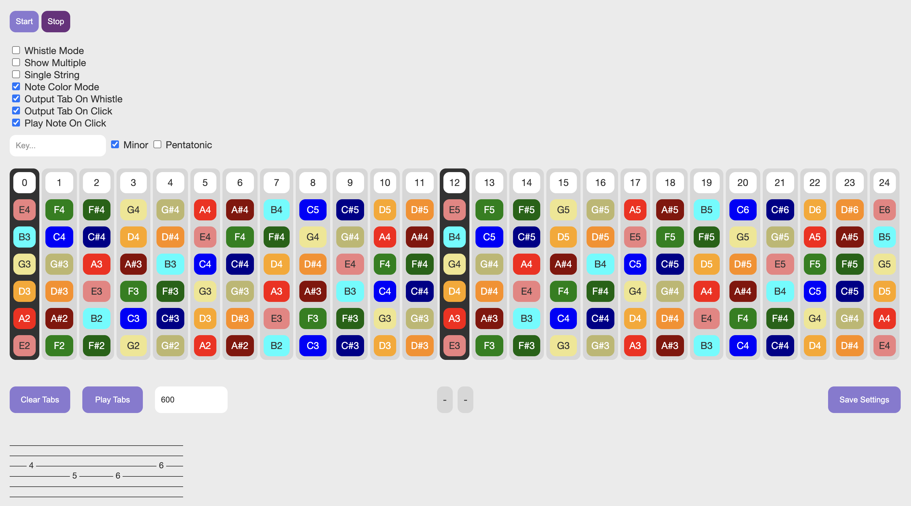

# Whistle To Tabs

### What does this do?

Primarily, it can be used to help guitarists figure out how to play a song by simply whistling it. The generated tabs aren't 100% accurate, but the notes usually are, so it's easier to work out the rest from there. Clicking on the notes also generates tabs, and clicking on the tabs allows you to delete them, so you can use this as a way to come up with your own songs or correct the generated tabs. Data is saved to local storage, so it persists after a refresh.

A recording of each note has also been included in order to allow for tab playback.

### How do I use it?

Simply download the source code, and open `index.html` in (preferably) Chrome.

